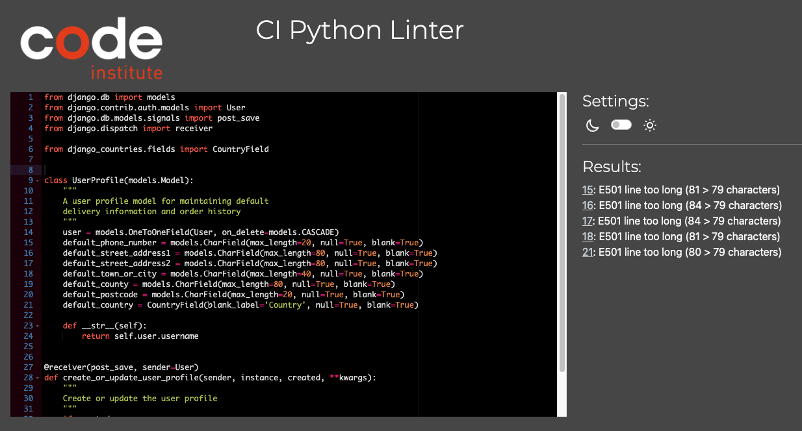

# MediCart

## Your trusted partner in healthcare excellence


(Developer: Alexander Strauch)

## **[Live site](https://medicart-94e507a2dc36.herokuapp.com/)**

## Table of contents

1. [Introduction](#introduction)

- [Project description](#project-description)
- [Purpose](#purpose)

2. [UX](#ux)

- [User demographic](#user-demographic)
- [User goals](#user-goals)
- [User expectations](#user-expectations)
- [User stories](#user-stories)

3. [Design](#design)

- [Colors](#colors)
- [Fonts](#fonts)
- [Wireframes](#wireframes)

4. [Features](#features)

- [Navigation](#navigation)
- [Homepage](#homepage)
- [Products](#products)
- [Shopping cart](#shopping-cart)
- [Checkout](#checkout)
- [User account](#user-account)
- [Security features](#security-features)
- [Admin features](#admin-features)
- [Additional features](#additional-features)

5. [Future features](#future-features)
6. [Database](#database)
7. [Technologies](#technologies)
8. [Agile tools](#agile-tools)
9. [Marketing](#marketing)
10. [Testing](#testing)

- [User stories testing](#user-stories-testing)
- [Manual testing](#manual-testing)
- [Responsiveness testing](#responsiveness-testing)
- [Browser compatibility](#browser-compatibility)
- [Lighthouse testing](#lighthouse-testing)
- [Code validation](#code-validation)
- [Known bugs](#known-bugs)

11. [Deployment](#deployment)
12. [Forking](#forking)
13. [Credits](#credits)
14. [Acknowledgements](#acknowledgements)

## Introduction

### Project description

MediCart is a comprehensive e-commerce platform specializing in healthcare products and medical supplies. Built with Django and integrated with Stripe for secure payments, the platform offers a user-friendly interface for both healthcare professionals and individual consumers to purchase medical supplies, equipment, and personal care items.

Key features:
- Intuitive product catalog with categorized medical supplies
- Secure user authentication and profile management
- Real-time shopping cart functionality
- Stripe payment integration for secure transactions
- Newsletter subscription for updates and offers
- Responsive design for all devices
- SEO-optimized with accessibility features

### Purpose

MediCart addresses the growing need for a reliable, user-friendly platform where healthcare professionals and individuals can easily purchase quality medical supplies and equipment. The platform aims to:

1. Provide easy access to essential medical supplies
2. Ensure a secure and efficient shopping experience
3. Maintain high standards of quality and reliability
4. Offer competitive pricing and regular updates on new products
5. Create a trusted community of healthcare professionals and consumers

[Back to table of contents](#table-of-contents)

## UX

### User demographic

The MediCart platform caters to several key user groups:

1. Healthcare professionals
   - Doctors and nurses in private practice
   - Medical clinic staff
   - Hospital department managers
   - Healthcare facility administrators

2. Healthcare facilities
   - Private medical clinics
   - Dental practices
   - Physiotherapy centers
   - Care homes and hospices
   - Diagnostic centers

3. Individual consumers
   - Patients with chronic conditions requiring regular supplies
   - Caregivers and family members managing medical needs
   - Health-conscious individuals seeking medical supplies
   - Home healthcare providers

4. Medical students and educators
   - Medical schools and training institutions
   - Healthcare education providers
   - Clinical skills labs

5. Small business owners
   - Independent pharmacies
   - Medical supply stores
   - Alternative medicine practitioners

### User goals

  - Convenient access to medical supplies: Users want a hassle-free experience to browse, compare, and purchase a wide range of healthcare products and medical supplies from a single platform without visiting multiple stores.

  - Secure and seamless transactions: Ensuring that all financial transactions are secure, users aim to make payments quickly and safely through trusted payment gateways like Stripe.

  - Efficient order management: Users expect an intuitive interface for tracking orders, managing returns, and accessing their purchase history to streamline their healthcare supply management.

  - Customized user experience: Healthcare professionals and individual consumers seek tailored recommendations, relevant product categories, and personalized interfaces to meet their specific needs efficiently.

  - Reliable customer support: Users look for accessible customer service to assist with inquiries, resolve issues promptly, and provide support throughout their shopping experience on the platform.

### User expectations

  - User-friendly interface: Users expect a clean, intuitive, and easy-to-navigate interface that allows them to find products quickly, with clear categorization and search functionality.

  - Wide range of products: Users anticipate a comprehensive selection of healthcare products and medical supplies, covering everything from basic personal care items to specialized medical equipment.

  - Fast and secure checkout: Users expect a streamlined checkout process with multiple payment options, including secure transactions through Stripe, and minimal friction during the purchase.

  - Accurate product information: Users look for detailed and accurate product descriptions, including specifications, usage instructions, and reviews, to make informed purchasing decisions.

  - Timely delivery and updates: Users expect prompt shipping with regular updates on the status of their orders, including estimated delivery times and tracking information.

### User stories

#### User

- As a new customer, I want to create an account so that I can purchase medical supplies.

- As a registered user, I want to log in to my account to access my profile and orders.

- As a registered user, I want to manage my profile information and preferences.

- As a customer, I want to browse medical products by category so I can find what I need.

- As a customer, I want to view detailed product information before purchasing.

- As a customer, I want to manage items in my shopping cart.

- As a customer, I want a smooth checkout process to complete my purchase.

- As a customer, I want to view my past orders.

- As a user, I want to receive notifications for authentication-related actions.

- As a customer, I want to receive notifications for cart-related actions.

- As a customer, I want to receive notifications during the checkout process.

- As a user, I want to receive clear notifications when errors occur.

#### Site owner

- As an admin, I want to manage the product inventory.

- As an admin, I want to manage and process orders.

- As an admin, I want to manage user accounts.

- As an admin, I want to receive notifications for product management actions.

[Back to table of contents](#table-of-contents)

## Design

### Colors

### Fonts

- **Poppins**: Main body text
  - Clean and modern sans-serif font
  - Excellent readability across different screen sizes
  - Used for general content, descriptions, and form elements

- **Montserrat**: Headings and titles
  - Bold and professional appearance
  - Used for h1-h6 elements
  - Provides clear visual hierarchy

### Wireframes

<details>
<summary>Desktop (click me)</summary>

</details>

<details>
<summary>Tablet (click me)</summary>

</details>

<details>
<summary>Mobile (click me)</summary>

</details>

[Back to table of contents](#table-of-contents)

## Features

### Navigation

- Responsive navigation bar that adapts to different screen sizes
- Search functionality to find products quickly
- Shopping cart icon with real-time item count
- User account dropdown menu for quick access to profile features
- Category navigation for easy product browsing

### Homepage

- Hero section with featured products
- Category showcase with direct links
- Newsletter signup form
- Quick links to popular medical supplies

### Products

- Product catalog with filtering and sorting options
- Detailed product pages with:
  - High-quality product images
  - Detailed descriptions
  - Price information
- Category-based browsing
- Search functionality with filters

### Shopping cart

- Real-time cart updates
- Quantity adjustment functionality
- Running total calculation
- Product image thumbnails in cart
- Remove item functionality
- Clear cart option
- Cart total and delivery cost calculation

### Checkout

- Secure payment processing through Stripe
- Order summary before payment
- Delivery information form
- Secure payment with error handling
- Loading overlay during payment processing

### User account

- User registration and authentication
- Profile management
- Order history view
- Default delivery information storage
- Password reset functionality
- Email verification

### Security features

- Secure user authentication
- Protected admin routes
- Secure payment processing
- CSRF protection
- Secure password handling

### Admin features

- Product management (add, edit, delete)
- User management
- Category management
- Stock level monitoring

### Additional features

- Responsive design for all screen sizes
- Error handling with user-friendly messages
- Form validation with clear error messages
- Newsletter subscription functionality

[Back to table of contents](#table-of-contents)

## Future features

- Product reviews & comparison

- Guest checkout

- Save for later with wishlist

- Order tracking

- Delivery preferences

- Sales analytics

- Prescription management

- Live chat support

- Subscription service

- Mobile app

- AI product recommendations

- Real-time search results

[Back to table of contents](#table-of-contents)

## Database

[Back to table of contents](#table-of-contents)

## Technologies

Core technologies

- **Python 3.9+**: The primary programming language used for the backend development
- **Django 4.2.17**: High-level Python web framework that encourages rapid development and clean, pragmatic design
- **JavaScript**: Used for frontend interactivity and dynamic content
- **HTML5**: Structure and content of web pages
- **CSS3**: Styling and responsive design
- **Bootstrap 5**: Frontend framework for responsive design and mobile-first approach
- **SQLite3**: Development database
- **PostgreSQL**: Production database

Authentication and user management

- **django-allauth 0.58.2**: Integrated set of Django applications addressing authentication, registration, account management
- **django-countries 7.5.1**: Provides country choices for use with forms, and a country field for models

Forms and styling

- **django-crispy-forms 2.1**: Controls the rendering behavior of Django forms
- **crispy-bootstrap5 2023.10**: Bootstrap 5 template pack for django-crispy-forms
- **django-summernote 0.8.20.0**: WYSIWYG editor for product descriptions

Payment processing

- **Stripe 7.6.0**: Payment processing integration for secure checkout

Image and file management

- **Pillow 10.1.0**: Python Imaging Library for image processing
- **Cloudinary 1.36.0**: Cloud-based image and video management
- **django-cloudinary-storage 0.3.0**: Cloudinary storage backend for Django

Email and marketing

- **mailchimp-marketing 3.0.75**: Mailchimp integration for email marketing and newsletter functionality
- **Facebook business page**: Facebook business page for brand presence, customer engagement, marketing & promotionm business information and customer service

Database and storage

- **psycopg2-binary 2.9.9**: PostgreSQL database adapter
- **dj-database-url 2.1.0**: Database configuration with URLs
- **django-storages 1.14.2**: Collection of custom storage backends for Django

Development and environment

- **python-dotenv 1.0.0**: Loads environment variables from a .env file
- **whitenoise 6.6.0**: Static file serving for Python web apps
- **gunicorn 21.2.0**: Python WSGI HTTP Server for UNIX

Development tools

- **Git**: Version control
- **GitHub**: Code repository and version control hosting
- **GitPod**: Cloud development environment
- **Heroku**: Cloud platform for deployment

Additional tools and services

- **Font Awesome**: Icon library
- **Google Fonts**: Web font library
- **Chrome DevTools**: Browser developer tools for testing and debugging
- **W3C Validator**: HTML and CSS validation
- **JSHint**: JavaScript code quality tool
- **PEP8**: Python code style guide
- **Leonardo.ai**: Product image generator
- **Balsamiq**: for wireframes

[Back to table of contents](#table-of-contents)

## Agile tools

## [Project board](https://github.com/users/alexstrauch/projects/3) (click me)


[Back to table of contents](#table-of-contents)

## Marketing

**mailchimp-marketing 3.0.75**: Mailchimp integration for email marketing and newsletter functionality

<details>
<summary>Mailchimp email for newsletter subscription (click me)</summary>

</details>

<br>

**Facebook business page**: Facebook business page for brand presence, customer engagement, marketing & promotionm business information and customer service

<details>
<summary>Wireframe for Facebook business page (click me)</summary>

</details>

Business model

MediCart operates as a B2C (Business-to-Consumer) e-commerce platform specializing in medical supplies and healthcare products. The platform bridges the gap between healthcare product manufacturers and end consumers, including both individual customers and healthcare professionals.

Target market

- Individual consumers seeking medical supplies
- Healthcare professionals
- Small medical practices
- Home care providers
- Sports medicine practitioners

Revenue model

- Direct product sales
- Premium membership options
- Professional account benefits
- Bulk purchase discounts

Core business intent

1. **Accessibility**
   - Make medical supplies easily accessible to the public
   - Provide a user-friendly platform for healthcare product procurement
   - Offer competitive pricing through direct supplier relationships

2. **Quality assurance**
   - Partner with reputable medical supply manufacturers
   - Implement strict quality control measures
   - Maintain proper storage and handling standards

3. **Customer education**
   - Provide detailed product information
   - Offer usage guidelines and recommendations
   - Share healthcare-related content and updates

4. **Professional services**
   - Special accounts for healthcare professionals
   - Bulk ordering capabilities
   - Priority support for medical practices

Marketing strategies

Digital Marketing

1. **Email marketing**
   - Mailchimp newsletter integration
   - Segmented email campaigns
   - Personalized product recommendations
   - Health tips and product updates
   - Special offers and promotions
   - Abandoned cart recovery emails

2. **Social media**
   - Facebook business page
     - Regular product updates
     - Health tips and advice
     - Customer testimonials
     - Community engagement
     - Live Q&A sessions
     - Special offers and promotions

3. **Content marketing**
   - Health and wellness blog
   - Product usage guides
   - Educational content
   - Industry news and updates
   - Expert interviews

4. **SEO strategy**
   - Healthcare-focused keywords
   - Local SEO for medical practices
   - Product-specific optimization
   - Medical terminology integration

Customer retention

1. **Loyalty program**
   - Points system for purchases
   - Member-only discounts
   - Early access to new products
   - Referral rewards

2. **Professional partnerships**
   - Healthcare provider discounts
   - Bulk purchase programs
   - Professional account benefits

3. **Customer service**
   - Dedicated support team
   - Product expertise
   - Quick response times
   - Multiple contact channels

Marketing channels

1. **Primary channels**
   - Website/E-commerce Platform
   - Email Marketing (Mailchimp)
   - Facebook Business Page

2. **Secondary channels**
   - Professional healthcare networks
   - Medical conferences
   - Healthcare industry events
   - Local medical practices


Future marketing plans

1. **Platform expansion**
   - Mobile app development
   - Additional social media platforms
   - Healthcare professional network

2. **Content development**
   - Video product guides
   - Expert webinars
   - Healthcare podcasts
   - Educational series

3. **Partnership growth**
   - Medical institution collaborations
   - Healthcare influencer partnerships
   - Industry event sponsorships

[Back to table of contents](#table-of-contents)

## Testing

### User stories testing

This outlines the testing procedures and results for each user story in the MediCart project. Each user story has been tested according to its acceptance criteria.

✅ = Passed | ❌ = Failed | 🟡 = Partially implemented | ⏳ = Not yet implemented

## Epic 1: User authentication & profile management

| User story | Testing steps | Expected result | Status |
|------------|--------------|-----------------|--------|
| 1.1 User registration | 1. Navigate to registration page<br>2. Enter email and password<br>3. Submit registration form<br>4. Check email for verification<br>5. Click verification link | - Form submits successfully<br>- Verification email received<br>- Account created after verification<br>- Welcome email received | ✅ |
| 1.2 User login | 1. Navigate to login page<br>2. Enter credentials<br>3. Test password reset | - Successful login<br>- Password reset email received | ✅ |
| 1.3 Profile management | 1. Access profile settings<br>2. Update personal information<br>3. Add shipping address<br>4. View order history | - Information updates saved<br>- Order history displayed correctly | ✅ |

## Epic 2: Product management

| User story | Testing steps | Expected result | Status |
|------------|--------------|-----------------|--------|
| 2.1 Product browsing | 1. Browse product categories<br>2. Apply filters<br>3. Test sorting options<br>4. Use search function | - Products display in grid<br>- Filters work correctly<br>- Sorting updates display<br>- Search returns relevant results | ✅ |
| 2.2 Product details | 1. Click product card<br>2. View images and description<br>3. Check price and availability<br>4. Test "Add to Cart" | - Details page loads correctly<br>- Images display properly<br>- Product info is clear<br>- Add to cart works | ✅ |
| 2.3 Product reviews | 1. Submit product review<br>2. Rate product<br>3. View other reviews<br>4. Check verified purchase badge | - Review submission works<br>- Rating system functions<br>- Reviews display correctly<br>- Badges show properly | ⏳|
| 2.4 Product comparison | 1. Select products to compare<br>2. View comparison table<br>3. Test sharing function | - Comparison table displays<br>- Features compared correctly<br>- Sharing works | ⏳ |
| 2.5 Real-time search | 1. Type in search box<br>2. Check dropdown results<br>3. Test on mobile devices | - Results appear while typing<br>- Dropdown is responsive<br>- Works on all devices | ⏳|

## Epic 3: Shopping cart & checkout

| User story | Testing steps | Expected result | Status |
|------------|--------------|-----------------|--------|
| 3.1 Shopping cart management | 1. Add items to cart<br>2. Update quantities<br>3. Remove items<br>4. Check cart persistence | - Items add/remove correctly<br>- Quantities update<br>- Totals calculate properly<br>- Cart saves between sessions | ✅ |
| 3.2 Checkout process | 1. Proceed to checkout<br>2. Select shipping address<br>3. Enter payment info<br>4. Complete purchase | - Checkout flow works<br>- Payment processes<br>- Order confirms<br>- Email received | ✅ |
| 3.3 Guest checkout | 1. Checkout as guest<br>2. Enter email<br>3. Complete purchase<br>4. Check order tracking | - Guest checkout works<br>- Order processes<br>- Tracking available<br>- Account creation offered | ✅ |
| 3.4 Save for Later | 1. Move items to wishlist<br>2. Check price notifications<br>3. Move back to cart | - Items save to wishlist<br>- Notifications work<br>- Cart/wishlist movement works | ⏳|

## Epic 4: Order management

| User story | Testing steps | Expected result | Status |
|------------|--------------|-----------------|--------|
| 4.1 Order tracking | 1. View order status<br>2. Check shipping updates<br>3. Test email notifications | - Status updates show<br>- Shipping info accurate<br>- Notifications received |  ⏳|
| 4.2 Order history | 1. View past orders<br>2. Download invoice<br>3. Test reorder function | - History displays correctly<br>- Invoices download<br>- Reorder works | 🟡 |
| 4.3 Delivery preferences | 1. Set delivery preferences<br>2. Add special instructions<br>3. Update notification settings | - Preferences save<br>- Instructions recorded<br>- Notifications work | ⏳ |

## Epic 5: Admin functionality

| User story | Testing steps | Expected result | Status |
|------------|--------------|-----------------|--------|
| 5.1 Product management | 1. Add new product<br>2. Edit existing product<br>3. Manage inventory | - Products add/edit<br>- Inventory updates<br>- Categories manage | ✅ |
| 5.2 Order management | 1. View orders<br>2. Update status<br>3. Search orders | - Orders viewable<br>- Status updates<br>- Search works | ⏳ |
| 5.3 User management | 1. Search users<br>2. Edit user roles<br>3. Manage accounts | - User search works<br>- Roles update<br>- Account management works | ✅ |
| 5.4 Sales analytics | 1. View dashboard<br>2. Generate reports<br>3. Export data | - Dashboard displays<br>- Reports generate<br>- Exports work | ⏳|
| 5.5 Customer support | 1. View customer details<br>2. Modify orders<br>3. Track issues | - Customer info accessible<br>- Order modifications work<br>- Issue tracking functions | ⏳ |

## Epic 6: Future features

| User story | Testing steps | Expected result | Status |
|------------|--------------|-----------------|--------|
| 6.1 Prescription management | 1. Upload prescription<br>2. Verify process<br>3. Check reminders | - Upload works<br>- Verification process<br>- Reminders send | ⏳ |
| 6.2 Live chat support | 1. Start chat<br>2. Connect with staff<br>3. Rate session | - Chat connects<br>- Staff available<br>- Rating works | ⏳ |
| 6.3 Subscription service | 1. Set up subscription<br>2. Test billing<br>3. Modify schedule | - Subscription creates<br>- Billing works<br>- Modifications save | ⏳ |
| 6.4 Mobile app | 1. Install app<br>2. Test features<br>3. Check notifications | - App functions<br>- Features work<br>- Notifications receive | ⏳ |
| 6.5 AI recommendations | 1. Create health profile<br>2. Check recommendations<br>3. Test personalization | - Profile creates<br>- Recommendations show<br>- Personalization works | ⏳ |

## Epic 7: User notifications

| User story | Testing steps | Expected result | Status |
|------------|--------------|-----------------|--------|
| 7.1 Authentication notifications | 1. Complete registration<br>2. Login/logout<br>3. Reset password | - Success messages show<br>- Login confirms<br>- Reset notifications work | ✅ |
| 7.2 Shopping cart notifications | 1. Add to cart<br>2. Update quantity<br>3. Remove item | - Add confirms<br>- Updates notify<br>- Removal confirms | ✅ |
| 7.3 Checkout notifications | 1. Place order<br>2. Process payment<br>3. Complete checkout | - Order confirms<br>- Payment notifies<br>- Completion confirms | ✅ |
| 7.4 Product management notifications | 1. Add product<br>2. Update stock<br>3. Delete product | - Addition confirms<br>- Stock alerts show<br>- Deletion confirms | ✅ |
| 7.5 Error Notifications | 1. Test form validation<br>2. Trigger payment error<br>| - Validation shows<br>- Errors display| ✅ |

## Legend
- ✅ = Passed: Feature is fully implemented and all tests pass
- ❌ = Failed: Feature is implemented but tests are failing
- 🟡 = Partially implemented: Feature is partially complete or under development
- ⏳ = Not yet implemented: Feature is planned but not yet implemented or tested

[Back to table of contents](#table-of-contents)

### Manual testing

#### Registration
| Test case | Steps | Expected result | Status |
|-----------|-------|-----------------|--------|
| User Registration | 1. Click "Register"<br>2. Fill in form with valid data<br>3. Submit form | User account created and verification email sent | ✅ |
| Email Verification | 1. Click verification link in email<br>2. Confirm email | Email verified and user can log in | ✅ |
| Invalid Registration | Try to register with:<br>1. Existing email<br>2. Mismatched passwords<br>3. Invalid email format | Appropriate error messages shown | ✅ |

#### Login/Logout
| Test Case | Steps | Expected result | Status |
|-----------|-------|-----------------|--------|
| User Login | 1. Enter valid credentials<br>2. Click login | Successfully logged in and redirected to home | ✅ |
| Invalid Login | Try to login with:<br>1. Wrong password<br>2. Unregistered email | Error message shown | ✅ |
| Logout | Click logout button | User logged out and redirected to home | ✅ |

#### Product browsing
| Test case | Steps | Expected result | Status |
|-----------|-------|-----------------|--------|
| View products | Visit products page | All products displayed with images and prices | ✅ |
| Product categories | Click different categories | Products filtered by category | ✅ |
| Product search | Use search bar | Relevant products shown based on search terms | ✅ |
| Product sorting | Use sort dropdown | Products sorted by selected criterion | ✅ |

#### Product details
| Test case | Steps | Expected result | Status |
|-----------|-------|-----------------|--------|
| View details | Click on product | Full product details shown | ✅ |
| Image gallery | Click product images | Image gallery opens and functions | ✅ |
| Stock status | Check stock indicator | Accurate stock level shown | ✅ |

#### Cart operations
| Test case | Steps | Expected result | Status |    
|-----------|-------|-----------------|--------|
| Add to cart | Click "Add to Cart" button | Product added and cart updated | ✅ |
| Update quantity | Modify quantity in cart | Quantity and total price updated | ✅ |
| Remove item | Click remove button | Item removed from cart | ✅ |
| Cart total | Add multiple items | Cart total correctly calculated | ✅ |

#### Payment
| Test case | Steps | Expected result | Status |
|-----------|-------|-----------------|--------|
| Valid payment | Complete checkout with valid card | Order processed successfully | ✅ |
| Invalid payment | Try invalid card details | Appropriate error message shown | ✅ |
| Order confirmation | Complete purchase | Confirmation email sent and order visible in profile | ✅ |

#### Profile management
| Test case | Steps | Expected result | Status |
|-----------|-------|-----------------|--------|
| Update profile | Edit profile information | Profile successfully updated | ✅ |
| Order history | View order history | Past orders displayed correctly | ✅ |
| Delivery info | Save delivery information | Information saved for future use | ✅ |

#### Subscription
| Test case | Steps | Expected result | Status |
|-----------|-------|-----------------|--------|
| Subscribe | Enter email and subscribe | Confirmation email sent | ✅ |
| Unsubscribe | Click unsubscribe link | Successfully unsubscribed | ✅ |
| Invalid email | Try invalid email format | Error message shown | ✅ |

#### Custom error pages
| Test case | Steps | Expected result | Status |
|-----------|-------|-----------------|--------|
| 404 Page | Visit non-existent URL | Custom 404 page shown | ✅ |
| 500 Page | Server error occurs | Custom 500 page shown | ✅ |
| 502 Page | Bad gateway error | Custom 502 page shown | ✅ |

[Back to table of contents](#table-of-contents)

### Responsiveness testing

#### Device testing
| Device | Viewport size | Status |
|--------|------------|--------|
| iPhone 12 | 390px × 844px| ✅ |
| iPad Pro 11| 834px × 1194px | ✅ |
| Desktop | 1920x1080 | ✅ |

#### Elements tested for responsiveness
- Navigation menu
- Product cards
- Shopping cart
- Checkout forms
- Profile pages
- Footer
- Error pages

[Back to table of contents](#table-of-contents)

### Browser compatibility

#### Browser testing
| Browser | Version | Status |
|---------|---------|--------|
| Chrome | Latest | ✅ |
| Firefox | Latest | ✅ |
| Safari | Latest | ✅ |
| Edge | Latest | ✅ |

[Back to table of contents](#table-of-contents)

### Lighthouse testing

<details>
<summary>Mobile lighthouse test (click me)</summary>

</details>

<details>
<summary>Desktop lighthouse test (click me)</summary>

</details>

[Back to table of contents](#table-of-contents)

### Code validation

#### HTML validation

<details>
<summary>HTML validation (click me)</summary>

</details>

#### CSS validation

<details>
<summary>CSS validation (click me)</summary>

</details>

#### JavaScript validation

<details>
<summary>JavaScript validation (click me)</summary>

</details>

#### Python validation

<details>
<summary>Python validation (click me)</summary>

</details>

## Deployment

I deployed this Django application on Heroku, taking advantage of its integration with GitHub. Here's a step-by-step overview of my deployment process:

1. **Heroku app creation**:
   I accessed my Heroku dashboard, navigated to “New,” and selected “Create new app.” Then, I picked a unique name for the app and chose the correct region.

2. **GitHub integration**:
   On the app’s “Deploy” tab, I chose GitHub as the deployment method. I linked my GitHub account and selected the repository with my Django app.

3. **Environment configuration**:
   In the "Settings" tab, I clicked on "Reveal Config Vars" and added the necessary environment variables:

- `CLOUDINARY_API_KEY`: My Cloudinary API key
- `CLOUDINARY_API_SECRET`: My Cloudinary API secret
- `CLOUDINARY_CLOUD_NAME`: My Cloudinary cloud name
- `DATABASE_URL`: The URL provided by Code Institute for the database
- `DEFAULT_FROM_EMAIL`: My default email address used with Gmail
- `EMAIL_HOST_PASSWORD`: My email host password with Gmail
- `EMAIL_HOST_USER`: My email address with Gmail
- `MAILCHIMP_API_KEY`: My Mailchimp API key
- `MAILCHIMP_AUDIENCE_ID`: My Mailchimp audience ID
- `MAILCHIMP_REGION`: My Mailchimp region
- `STRIPE_PUBLIC_KEY`: My Stripe public key
- `STRIPE_SECRET_KEY`: My Stripe secret key
- `STRIPE_WH_SECRET`: My Stripe webhooks secret

4. **Database configuration**:
   Since my database is supplied by Code Institute, I verified that the `DATABASE_URL` in Config Vars was correctly configured with the provided database URL. In my Django settings, I ensured this environment variable was used to set up the database connection.

5. **Buildpack configuration**:
   In the “Settings” tab, I navigated to the “Buildpacks” section, clicked “Add buildpack,” and chose “heroku/python.”

6. **Deployment configuration**:
   On the “Deploy” tab, under “Deployment method,” I verified that GitHub was chosen. In the “App connected to GitHub” section, I made sure my repository was linked.

7. **Manual deploy**:
   I scrolled down to the “Manual deploy” section, selected the main branch, and clicked “Deploy Branch.”

8. **Verify deployment**:
   After the deployment was complete, I clicked “View” to open the app and confirm it was functioning properly.

[Back to table of contents](#table-of-contents)

## Forking

If you'd like to fork this repository and run it locally, follow these steps:

1. **Fork the repository**:
   - Navigate to the GitHub repository: [MediCart](https://github.com/alexstrauch/medicart)
   - In the top-right corner of the page, click the "Fork" button.
   - This will create a copy of the repository in your GitHub account.

2. **Clone your fork**:
   - On your forked repository page, click the "Code" button and copy the URL.
   - Open your terminal and run:
     ```
     git clone [URL you just copied]
     ```
   - This creates a local copy of the repository on your machine.

3. **Set up virtual environment**:
   - Navigate into the project directory:
     ```
     cd [project directory name]
     ```
   - Create a virtual environment:
     ```
     python -m venv venv
     ```
   - Activate the virtual environment:
     - On Windows: `venv\Scripts\activate`
     - On macOS and Linux: `source venv/bin/activate`

4. **Install dependencies**:
   - With your virtual environment activated, install the required packages:
     ```
     pip install -r requirements.txt
     ```

5. **Set up environment variables**:
   - Create a `env.py` file in the root directory of the project.
   - Add the following variables (replace with your actual values):
     ```
     SECRET_KEY=your_secret_key
     DATABASE_URL=your_database_url
     CLOUDINARY_API_KEY=your_cloudinary_api_key
     CLOUDINARY_API_SECRET=your_cloudinary_api_secret
     CLOUDINARY_CLOUD_NAME=your_cloudinary_cloud_name
     DEFAULT_FROM_EMAIL=your_email_address
     EMAIL_HOST_PASSWORD=your_email_host_password
     EMAIL_HOST_USER=your_email_host_user
     MAILCHIMP_API_KEY=your_mailchimp_api_key
     MAILCHIMP_AUDIENCE_ID=your_mailchimp_audience_id
     MAILCHIMP_REGION=your_mailchimp_region
     STRIPE_PUBLIC_KEY=your_stripe_public_key
     STRIPE_SECRET_KEY=your_stripe_secret_key
     STRIPE_WH_SECRET=your_stripe_wh_secret
     DEBUG=True
     ```

    
    Important notes: 
    - Make sure to set `DEBUG=True` for local development and testing in `env.py`. This should be set to `DEBUG=False` in production / when the app is live.
    - Remember to never commit the `env.py` file or any sensitive information to version control. If you plan to deploy your fork, make sure to set up the necessary environment variables in your deployment environment.

6. **Apply Migrations**:
   - Run the following commands to apply database migrations:
     ```
     python manage.py makemigrations
     python manage.py migrate
     ```

7. **Run the development server**:
   - Start the Django development server:
     ```
     python manage.py runserver
     ```
   - Open a web browser and navigate to `http://127.0.0.1:8000/` to view the application.


[Back to table of contents](#table-of-contents)

## Credits

-

-

-

-

-

[Back to table of contents](#table-of-contents)

## Acknowledgements

[Back to table of contents](#table-of-contents)
